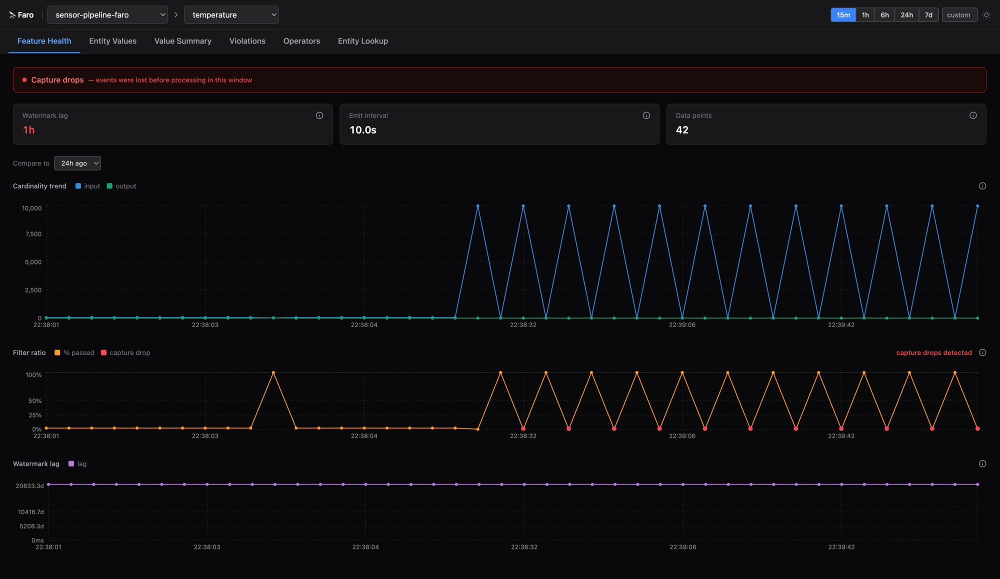

# 🔭 Faro

[](https://github.com/Olamyy/faro/actions/workflows/ci.yml)
[](LICENSE)
[](https://openjdk.org/projects/jdk/17/)
[](https://flink.apache.org/)
[](https://spark.apache.org/)
[](https://www.python.org/)

Faro is an observability layer for streaming feature pipelines. It captures operator
cardinality, watermark lag, per-entity feature values, and automatic violation detection
without changing your pipeline logic. It's entirely passive and non-intrusive.
You can route capture events to wherever you already send observability data,
<a href="https://grafana.com" target="_blank">Grafana</a>,
<a href="https://newrelic.com" target="_blank">New Relic</a>,
<a href="https://www.honeycomb.io" target="_blank">Honeycomb</a>,
or your existing Kafka topics. If you don't have a monitoring stack, faro includes a
[built-in query API and UI](#query-api-and-ui) backed by DuckDB over Parquet for ad-hoc
exploration and alerting.

## What problem does it solve?

Feature pipeline observability today happens at rest. You query your data warehouse, look at
model metrics, or wait for a downstream alert. When a feature value is off, you have almost
no visibility into when the feature went bad, which operator dropped records, or what value
a specific entity had at processing time.

Streaming engines process millions of records per second and emit nothing observable by
default. You find out something is wrong when:

- A downstream model starts producing bad predictions.
- A user reports that their feature value is stale or missing.
- An SLA alert fires, and you have no idea when the pipeline actually went silent.

Faro closes that gap by making the inside of your pipeline visible at runtime, per operator,
per entity, without touching your pipeline logic.

## Installation

Faro provides adapters for multiple streaming engines. Pick the one that matches your stack.

### Apache Flink (Java)

Requires **Flink 1.18.x** and **Java 17**. `faro-flink` declares Flink as `compileOnly` so it
depends on your existing runtime without bundling Flink.

```gradle
dependencies {
    implementation 'dev.faro:faro-flink:0.1.0-SNAPSHOT'
}
```

### Apache Spark Structured Streaming (Java/Scala)

Requires **Spark 3.5.x** and **Scala 2.13**. `faro-spark` declares Spark as `compileOnly`. A
Databricks-compatible JAR (`faro-spark-databricks.jar`) is also published for cluster
attachment.

```gradle
dependencies {
    implementation 'dev.faro:faro-spark:0.1.0-SNAPSHOT'
}
```

## Examples

### Flink, aggregate mode

Track cardinality and watermark health for a window operator. No per-entity data is captured.

```java
FaroFlink faro = new FaroFlink("order-pipeline",
    AsyncCaptureEventSink.wrap(HttpCaptureEventSink.factory("http://faro-api:9000/ingest"), 1000));

FaroConfig<OrderEvent> config = FaroConfig.<OrderEvent>builder()
    .features("order_count", "revenue_7d")
    .build();

DataStream<OrderSummary> output = input
    .keyBy(e -> e.merchantId)
    .window(TumblingEventTimeWindows.of(Duration.ofMinutes(5)))
    .process(faro.windowTrace(new OrderAggFn(), config))
    .uid("order-agg-window");
```

```bash
# Is the pipeline flowing? When did each operator last emit?
curl "http://localhost:9000/pipelines/order-pipeline/health"

# Has cardinality dropped in the last hour? Is the watermark lagging?
curl "http://localhost:9000/features/order_count/health?pipeline_id=order-pipeline&window=1h"

# Compare throughput now vs 24 hours ago
curl "http://localhost:9000/features/order_count/health?pipeline_id=order-pipeline&window=1h&compare_to=24h_ago"

# Any freshness violations?
curl "http://localhost:9000/violations?pipeline_id=order-pipeline&severity_gte=HIGH"
```

### Flink, entity mode

Capture the feature value for each entity at processing time. Useful for debugging model
inputs and auditing what a specific user or device saw.

```java
FaroFlink faro = new FaroFlink("user-feature-pipeline",
    AsyncCaptureEventSink.wrap(HttpCaptureEventSink.factory("http://faro-api:9000/ingest"), 1000));

FaroConfig<PurchaseEvent> config = FaroConfig.<PurchaseEvent>builder()
    .feature("purchase_amount_7d", FaroFeatureConfig.<PurchaseEvent>builder()
        .entityKey(e -> e.userId)
        .featureValue(e -> e.rollingAmount)
        .valueType(CaptureEvent.FeatureValueType.SCALAR_DOUBLE)
        .classification(DataClassification.NON_PERSONAL)
        .sampleRate(0.1)
        .build())
    .build();

DataStream<FeatureVector> output = input
    .keyBy(e -> e.userId)
    .window(TumblingEventTimeWindows.of(Duration.ofMinutes(5)))
    .process(faro.windowTrace(new RollingAmountFn(), config))
    .uid("rolling-amount-window");
```

```bash
# What value did this user have in the last hour?
curl "http://localhost:9000/features/purchase_amount_7d/values?pipeline_id=user-feature-pipeline&entity_id=user-42&window=1h"

# Distribution across all entities: min, max, mean, p50, p95
curl "http://localhost:9000/features/purchase_amount_7d/values/summary?pipeline_id=user-feature-pipeline&window=1h"
```

### Spark / Databricks, aggregate mode

```java
FaroStreamingListener listener = new FaroStreamingListener();
spark.streams().addListener(listener);

FaroSpark faro = new FaroSpark("order-pipeline",
    DeltaCaptureEventSink.factory(spark, "/mnt/faro/capture-events"))
    .withStreamingContext("event_time", "window", listener);

FaroConfig<Row> config = FaroConfig.<Row>builder()
    .features("order_count", "revenue_7d")
    .build();

input.writeStream()
    .foreachBatch((batchDf, batchId) -> {
        faro.trace("order-agg-window", CaptureEvent.OperatorType.AGG, config,
            ds -> ds.groupBy(window(col("event_time"), "5 minutes"))
                    .agg(count("*").as("order_count"), sum("amount").as("revenue_7d")))
            .apply(batchDf);
    })
    .start();
```

## Query API and UI

If you don't have an existing monitoring stack, `faro-api` gives you a REST
query layer and a dashboard for exploration. For the query API, vents are stored as Parquet files and queried via DuckDB.

```bash
docker run -p 9000:9000 \
  -e FARO_LOCAL_PATH=/var/faro/parquet \
  -v faro-data:/var/faro/parquet \
  faro-api
```

The UI starts alongside the API and is available at `http://localhost:9000/ui`.



Six views are available:

- Feature Health (cardinality trend, filter ratio, watermark lag,
violation signals)
- Entity Values,
- Value Summary (distribution statistics)
- Violations (filterable feed with severity)
- Operators (per-operator throughput and health), and
- Entity Lookup (cross-pipeline feature lineage for a single entity).


## How it works

Every instrumented operator emits two kinds of events.

**AGGREGATE events** fire on each flush (window close, periodic timer). They capture input
and output cardinality, watermark, event-time range, late event count, and whether any
observability events were dropped since last flush.

**ENTITY events** fire per record when you configure a feature with an entity key and value
extractor. They capture the entity ID, the raw feature value at processing time, and event
time. Features classified as `PERSONAL` or `SENSITIVE` are automatically suppressed and
degrade to AGGREGATE mode so no entity data is ever emitted.

A *pipeline* is a named unit containing one or more instrumented *operators*. Events flow
from operators into a *sink*, which routes them to your destination of choice.

## Faro vs alternatives

Every tool in this space can surface *some* feature health signal, but they all require you
to emit custom metrics, write alerting rules, or run additional infrastructure. Faro captures
pipeline internals passively at the operator level and requires no changes to your pipeline
logic or data schema.

**Observability tools**

| | Faro | Datadog | Grafana | New Relic | Honeycomb |
|---|---|---|---|---|---|
| Pipeline-level cardinality & watermark | ✓ | needs custom metrics | needs custom metrics | needs custom metrics | needs custom spans |
| Per-entity feature value at processing time | ✓ | ✗ | ✗ | ✗ | ✗ |
| Freshness, drift, null-rate, cardinality violations | ✓ | needs alerting rules | needs alerting rules | needs alerting rules | needs alerting rules |
| No changes to pipeline logic or data schema | ✓ | ✗ | ✗ | ✗ | ✗ |
| No new observability service required | ✓ (stdout/Kafka/OTLP) | ✗ | ✗ | ✗ | ✗ |

**Feature stores**

| | Faro | Hopsworks | SageMaker Feature Store | Tecton | Feast | Databricks Feature Store |
|---|---|---|---|---|---|---|
| Pipeline-level cardinality & watermark | ✓ | ✗ | ✗ | partial | ✗ | ✗ |
| Per-entity feature value at processing time | ✓ | serving store only | serving store only | serving store only | serving store only | serving store only |
| Freshness, drift, null-rate, cardinality violations | ✓ | partial | partial | ✓ | ✗ | partial |
| No changes to pipeline logic or data schema | ✓ | ✗ | ✗ | ✗ | ✗ | ✗ |
| No new observability service required | ✓ (stdout/Kafka/OTLP) | ✗ | ✗ | ✗ | ✗ | ✗ |


## Components

| Module     | Description |
|------------|-------------|
| faro-core  | `CaptureEvent` model with JSON and Avro serialization. Engine-agnostic with no adapter dependencies. |
| faro-flink | Flink 1.18.x adapter that wraps operators and sink implementations. |
| faro-spark | Spark 3.5.x / Scala 2.13 adapter. Also published as a Databricks-compatible fat JAR. |
| faro-api   | FastAPI service with ten REST endpoints covering ingest, pipeline health, feature health, entity values, violations, trace lookup, and entity cross-pipeline lineage. Backed by DuckDB over Parquet. |
| faro-e2e   | Runnable demo jobs for Flink and Spark covering every sink variant and both AGGREGATE and ENTITY modes. |

**Sink options**

| Sink | Adapter | When to use |
|------|---------|-------------|
| `StdoutCaptureEventSink` | FLINK, DATABRICKS | Local development and testing |
| `KafkaCaptureEventSink` | FLINK, DATABRICKS | You already have Kafka or Redpanda |
| `HttpCaptureEventSink` | FLINK, DATABRICKS | You want faro-api, or any webhook receiver |
| `OtelCaptureEventSink` | FLINK, DATABRICKS | You already have Grafana, New Relic, Honeycomb, or any OTLP-compatible backend |
| `DeltaCaptureEventSink` | DATABRICKS | You're on Spark or Databricks and want events in a Delta table |
| `AsyncCaptureEventSink` | FLINK, DATABRICKS | Wraps any event-driven sink above. Decouples capture from operator threads |

All sinks are fire-and-forget. Failures are logged and never propagate to your pipeline.
`AsyncCaptureEventSink` additionally tracks overflow. When the in-memory ring buffer fills
up, it sets a `capture_drop_since_last` flag on the next flush event so you can see it in
the query layer.

## Roadmap

**Engine adapters**

Flink and Spark Structured Streaming are supported. A Kafka Streams adapter is planned.

**Extended query API**

The current query layer covers cardinality trends, watermark lag, violation detection, entity
values, trace lookup, and entity lineage. Planned additions include late-event rate per
window, missing window detection, per-window fire-delay distribution, and cross-operator
cardinality funnel queries.

**Value-level health checks**

The violation system detects `FRESHNESS`, `MEAN_DRIFT`, `NULL_RATE`, and
`CARDINALITY_ANOMALY`. Planned additions include NOT_NULL and RANGE assertions in entity
mode, and a Z-score baseline check over a rolling 7-day window.

**Entity mode and lineage**

Per-entity feature lookup and trace-level lineage are shipped. Planned additions include
bitemporal indexing and per-entity erasure.

